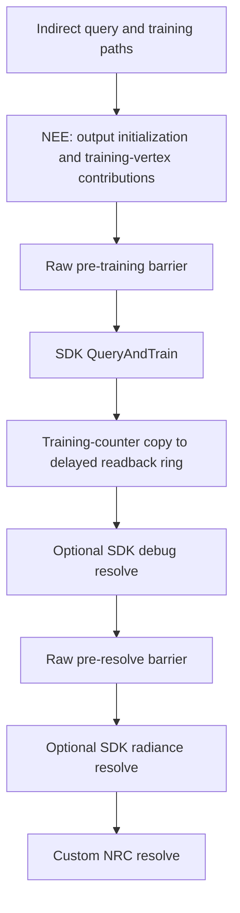

# NRC execution-path research — 2026-09-10

Scope: orchestration around NRC and importance sampling, preserving sampling algorithms, training behavior, visual effects, and diagnostic modes. Runtime baseline: `6ba63aa6e`. This is a source audit and experiment plan, not a GPU performance result.

## Recommended order

| Priority | Target | Evidence | Next decision |
| --- | --- | --- | --- |
| 1 | NRC/DXVK synchronization boundary | Raw SDK-facing barriers coexist with DXVK's accumulated access tracker; the counter copy can flush a broad global barrier. | Measure the entire handoff and identify which dependencies are necessary before changing it. |
| 2 | NRC-specific NEE shader variant | The universal NEE shader retains a ReSTIR reservoir interface and runtime GI branches in NRC mode. | First contained shader experiment: compare compiled register/shared-memory use and total GPU time with GI-only work compiled out. |
| 3 | NEE cache maintenance scheduling | Every enabled update covers 32,768 cells, including maintenance for cells without new tasks. | Measure live/empty/retained-sample occupancy and pass cost; evaluate scheduling only provably idle cells out. |
| 4 | Indirect/NEE/resolve intermediate traffic | NEE writes lobe outputs that NRC resolve subsequently reads and updates. | Measure bandwidth and cache behavior; preserve NEE's pre-training contribution. |
| 5 | Common descriptor preparation | Shared resources are repeatedly assembled, but descriptor updates are batched per dispatch. | Measure CPU recording time before undertaking a persistent-common-descriptor-set redesign. |

There is no evidence yet that the small sampler-object cleanup explains a major bottleneck. It removed about 0.397 microseconds of isolated driver creation/destruction work per common bind on the measured machine; this is already committed separately. ReSTIR GI disabled-reuse fast paths and optional sparse preparation are lower priority for ordinary NRC use.

## Actual NRC handoff

Relevant sources:

- [Top-level ordering](../src/dxvk/rtx_render/rtx_context.cpp): `dispatchIntegrate`, `dispatchPathTracing`, and the subsequent NRC dispatch.
- [Indirect and NEE dispatch](../src/dxvk/rtx_render/rtx_pathtracer_integrate_indirect.cpp): `dispatch` and `dispatchNEE`.
- [NRC integration](../src/dxvk/rtx_render/rtx_neural_radiance_cache.cpp): `dispatchTrainingAndResolve`, `copyNumberOfTrainingRecords`, and `dispatchResolve`.
- [SDK wrapper](../src/dxvk/rtx_render/rtx_nrc_context.cpp): `queryAndTrain`, `resolve`, and `tryReallocateBuffer`.
- [DXVK synchronization](../src/dxvk/dxvk_context.cpp): `copyBuffer`, `commitInitBarriers`, and `commitPostBarriers`.
- [Barrier accumulation](../src/dxvk/dxvk_barrier.cpp): `accessBuffer` and `recordCommands`.

DXVK dispatches record resource accesses in a pending tracker. NRC's raw Vulkan calls do not update that tracker. A dirty source or destination in `copyBuffer` causes the accumulated tracker to emit a barrier. Buffer accesses contribute to combined stage/access masks in a global memory barrier. NRC buffer metadata currently uses `ALL_COMMANDS` as its stage mask.

These facts establish a potentially broad handoff. They do **not** establish that the barrier is redundant: SDK query/training writes data, and the counter copy must observe those writes. Moving the copy can merely move a tracker flush to the following resolve dispatch rather than eliminate it. Raw SDK work also needs accurate source-stage accounting, particularly when the preceding path tracer used a ray-tracing pipeline and SDK work uses compute.

Important correction to the initial hypothesis: NEE reads/writes `TrainingPathVertices`, which indirect integration also writes. Its pre-dispatch hazard check can therefore flush the accumulated indirect accesses before NEE runs. The compiled `integrate_nee.spv` entry point includes `TrainingPathVertices` but no NRC counter buffer. NEE's post-dispatch tracking does not restore that counter write, and raw SDK calls do not register their writes. Thus the counter copy is **not proven to flush a stale counter dependency in the ordinary path**. Check actual tracker state and SDK-emitted synchronization; do not use the earlier possibility as a demonstrated per-frame duplication. The raw pre-resolve barrier uses COMPUTE as its source stage; the mode-selected COMPUTE/RAY_TRACING source belongs to the pre-training barrier.

## Counter-copy decision

The readback copies the `TrainingRecords` counter into `frameIdx % kMaxFramesInFlight`; CPU adaptation reads and resets the corresponding delayed slot. Removing readback would change adaptive training and statistics.

The local bundled SDK contract, [NrcVk.h](../submodules/nrc/Include/NrcVk.h), lists counters among `Resolve` outputs. Therefore:

| Configuration | Can source inspection justify moving the copy after resolve? |
| --- | --- |
| Custom resolve only; SDK and SDK debug resolve disabled | The custom shader does not bind the counter, so its value should be unchanged by that shader. Synchronization and scheduling benefits still need verification. |
| SDK debug resolve enabled | No unconditional move: the optional SDK call may write counters. |
| SDK radiance resolve enabled | No unconditional move: the optional SDK call may write counters. |
| Runtime option changes, camera cuts, resize, reset | Preserve original counter-ring identity, clear/reset timing, and SDK resource lifetime. |

The first experiment should retain all existing dependencies and compare actual emitted barriers before attempting a conditional reorder. A production integration could expose an explicit external-compute boundary that flushes appropriate pre-SDK work, registers SDK output accesses, and restores affected state. That is a design proposal, not permission to clear the pending tracker: it contains unrelated resources and deferred transitions too.

NVIDIA distributes NRC as binaries. Its [integration guide](https://github.com/NVIDIA-RTX/RTXGI/blob/main/Docs/NrcGuide.md) describes custom resolve support but does not provide a complete internal synchronization contract. The [reference integration wrapper](https://github.com/NVIDIA-RTX/RTXGI/blob/main/Samples/Pathtracer/NrcIntegration.cpp) delegates to SDK methods; it does not prove that Remix's custom resolve or readback barriers are unnecessary. Use the bundled header for this checkout's API contract rather than assuming upstream implementation details match its DLL.

## NEE execution paths

### Contained shader specialization experiment

`integrate_nee.comp.slang` defines `RAB_HAS_RESTIR_GI_RESERVOIRS` and `ENABLE_NRC`, and the CPU selects a single `IntegrateNEEShader`. The source constructs a reservoir and guards GI sample creation/store with runtime `cb.enableReSTIRGI`. Disassembly of the built baseline confirms `RestirGIReservoirBuffer` remains in the shader entry-point interface. The CPU correctly binds a null reservoir when GI is inactive; it does not retain a live GI reservoir for NRC.

An NRC-specific variant could compile out GI-only reservoir construction, target-PDF evaluation and storage. Preserve the existing variant for GI and all common material/visibility code. In particular, `RAB_Surface` supplies `portalSpace` and `isViewModel` to NEE visibility outside the GI branches; material reconstruction is also required by ordinary NEE. Removing either wholesale would be incorrect.

This is a promising first implementation experiment because its scope is narrower than cache scheduling or synchronization redesign. It has no measured speedup yet: a frame-uniform disabled branch may already be cheap, and specialization can change register allocation unexpectedly. Compare generated interfaces and driver pipeline statistics before a frame-time/output A/B. Follow `docs/ShaderVariants.md` when implementing. Local disassembly artifact: `_Comp64Release/core-render-validation/integrate-nee.spvasm`.

### Pass ordering and maintenance

`dispatchNEE` cannot simply be skipped when NRC is active or when the cache is disabled. In [integrate_nee.comp.slang](../src/dxvk/shaders/rtx/pass/integrate/integrate_nee.comp.slang):

- Lines 98–105 clear primary misses for the following NRC resolve.
- Lines 111–130 distribute indirect radiance into diffuse/specular outputs even with the cache disabled.
- Lines 260–264 add first-bounce NEE radiance to NRC training vertices before SDK query/training consumes them.

Consequently, moving all NEE work after NRC training, or fusing it wholesale with the later resolve, would change training inputs. A future split could keep light evaluation and training writes before SDK execution while changing how final output is stored, but must preserve half-float storage rounding, firefly clamps, hit distances, selected primary/secondary surfaces, and debug behavior. A split also adds dispatches or storage; no net gain is established.

Cache maintenance itself dispatches 4,096 groups of 128 threads for 32 cubed cells. See [rtx_nee_cache.cpp](../src/dxvk/rtx_render/rtx_nee_cache.cpp), [cache dimensions](../src/dxvk/shaders/rtx/algorithm/nee_cache_data.h), and [update shader](../src/dxvk/shaders/rtx/pass/nee_cache/update_nee_cache.comp.slang).

A cell with no new tasks is not necessarily idle. Existing candidates decay and remap each frame; cached samples refresh using frame-dependent random values; reshuffle resilience retains samples temporarily and ages them toward expiry. An active-cell scheduler would need live candidate cells, new-task cells, retained-sample/expiry cells, reset coverage, and unchanged original cell coordinates for random seeds. The current shader batches eight cells with group-wide barriers, so per-cell early returns would be invalid. Start by measuring occupancy classes and costs rather than inserting an early return.

## Measurement plan and acceptance criteria

1. Record an NRC frame with separate CPU and GPU intervals for indirect integration, NEE integration, pre-SDK handoff, SDK query/training, counter transfer, resolve, and subsequent consumers. Distinguish GPU execution from CPU command recording and idle gaps.
2. Capture actual Vulkan barriers, including SDK and raw integration calls. The ordinary DXVK barrier statistic is insufficient by itself: `DxvkBarrierSet::recordCommands` increments it, while direct SDK/integration calls bypass that path.
3. Compare the unmodified path with one candidate at a time. Hold camera, resolution, settings, workload and warmup constant; alternate candidates and report total handoff/frame timing, not just a barrier count or isolated dispatch win.
4. Validate ray-query and ray-tracing paths, custom and optional SDK/debug resolve, training enabled/disabled, adaptive dimensions enabled/disabled, camera cuts, resize, activation toggles, and multiple frames-in-flight.
5. Compare delayed training counters, adaptive dimensions, training convergence and rendered outputs. Synchronization validation is necessary but does not prove the SDK's hidden algorithmic dependencies or visual equivalence.

Research status: source-level dependencies and candidate boundaries are documented. No new runtime changes or performance claims are made by this report. SDK-internal barrier behavior and the dominant GPU cost remain empirical questions.
